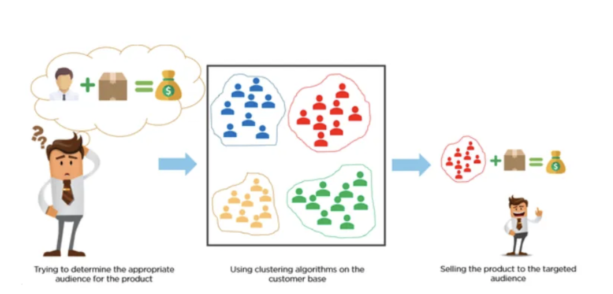
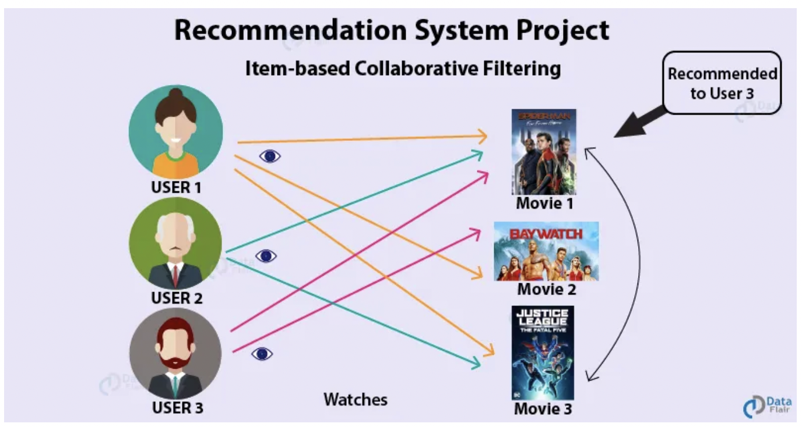
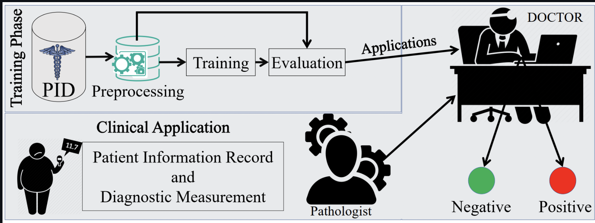

# Hi there, I'm Shankar Gurjar 👋

I'm passionate about Machine Learning, Data Science, Large Language Models (LLMs) and Generative AI.

I love exploring how AI can solve real-world problems and create new possibilities. Always excited to learn and share cool projects!

# 👨‍🎓🙋‍♂️ About Me 💼🎒:

🔭 I hold a Masters Degree in applied data science with a specialisation in machine learning, Deep learning & Generative AI from Clarkson University and I have 6+ years of experience building and deploying machine learning and deep learning applications.

I have a strong practical and theoretical experience in the development of Large Language Models (LLMs) and Generative AI.

🔭 Some of the projects I have delivered and that helped in gaining strong hands on expertise include:

* Customer Segmentation 
* Product Recommendation engines
* Fraud Detection
* Risk assessment & Claims prediction
* Product Demand Forecasting
* Investment Portfolio stress testing
* Customer Churn Prediction
* Lifetime Value Prediction
* Fraud Detection in Healthcare Billing Systems
* Disease Diagnosis
* Price optimization & Personalized marketing
* AI-based chatbot development & Service operations optimization

🔭 I've used different Machine Learning and Deep Learning models in real-time projects. Below are some used models:

* Linear Regression
* Logistic Regression
* Support Vector Machines (SVM)
* Decision Trees (DT)
* Random Forests (RF)
* K-Nearest Neighbors (KNN)
* Deep Neural Networks
* Convolutional Neural Networks (CNN)
* Recurrent Neural Networks (RNN)
* Naive Bayes (NB)
* Gradient Boosted Decision Trees (GBDT)
* XGBoost
* Long Short-Term Memory (LSTM)

🔭 Below are some state-of-the-art (SOTA) time series forecasting models used in various real-time projects:

* Auto-Regressive (AR) Model
* Auto-Regressive Moving Averages (ARMA) Model
* Auto-Regressive Integrated Moving Averages (ARIMA) Model
* Neural Hierarchical Interpolation of Time Series (N-HiTS) Model
* Seasonal Auto-Regressive Integrated Moving Averages (SARIMA) Model
* The Prophet Forecasting Model by Facebook

🔭 Furthermore, below are some of the tools used during my experience for Generative AI:

* Langchain
* LangGraph
* Retrieval Augmented Generation (RAG)
* Llama Index
* OpenAI API
* Mixtral (LLM)
* Llama 2 (LLM)
* GPT - 3 (LLM)
* GPT - 3.5 (LLM)
* GPT - 4 (LLM)

  

# 🪚🔧 My Skills 😀😀:

**Programming Languages**

<a href="https://www.python.org/" target="_blank" rel="noreferrer">Python</a>
<a href="https://www.r-project.org/" target="_blank" rel="noreferrer">R</a>
<a href="" target="_blank" rel="noreferrer">SQL</a>
<a href="https://www.java.com/en/" target="_blank" rel="noreferrer">Java</a>

**Databases**

<a href="https://www.mysql.com" target="_blank" rel="noreferrer">MySQL</a>
<a href="https://www.mongodb.com/" target="_blank" rel="noreferrer">MongoDB</a>
<a href="https://www.snowflake.com/" target="_blank" rel="noreferrer">SnowFlake</a>

**Python Frameworks for Data Science**

<a href="https://numpy.org" target="_blank" rel="noreferrer">Numpy</a>
<a href="https://pandas.pydata.org" target="_blank" rel="noreferrer">Pandas</a>
<a href="https://www.tensorflow.org" target="_blank" rel="noreferrer">Tensorflow</a>
<a href="https://scikit-learn.org/stable/" target="_blank" rel="noreferrer">Sklearn</a>
<a href="https://pytorch.org" target="_blank" rel="noreferrer">PyTorch</a>
<a href="https://www.dask.org" target="_blank" rel="noreferrer">Dask</a>
<a href="https://opencv.org" target="_blank" rel="noreferrer">OpenCV</a>
<a href="https://matplotlib.org" target="_blank" rel="noreferrer">Matplotlib</a>
<a href="https://seaborn.pydata.org" target="_blank" rel="noreferrer">Seaborn</a>

**Toolkits/Frameworks**

<a href="https://airflow.apache.org" target="_blank" rel="noreferrer">Apache Airflow</a>
<a href="https://kafka.apache.org/" target="_blank" rel="noreferrer">Apache Kafka</a>
<a href="https://www.docker.com" target="_blank" rel="noreferrer">Docker</a>
<a href="https://aws.amazon.com" target="_blank" rel="noreferrer">Amazon Web Services</a>
<a href="https://git-scm.com" target="_blank" rel="noreferrer">Git</a>
<a href="https://www.tableau.com" target="_blank" rel="noreferrer">Tableau</a>

**Data Engineering**

<a href="https://www.selenium.dev" target="_blank" rel="noreferrer">Selenium</a>
<a href="https://www.gnu.org/software/bash/" target="_blank" rel="noreferrer">Shell Scripting</a>
<a href="" target="_blank" rel="noreferrer">Web Scraping</a>
<a href="" target="_blank" rel="noreferrer">Data Analysis</a>
<a href="" target="_blank" rel="noreferrer">Data Wrangling</a>

# 🖥 My Machine Learning Projects 

The following links include detailed descriptions within each GitHub repository:

| 🚀 [Customer Segmentation using K-Means Clustering](https://github.com/Shankar-Gurjar/Customer_Segmentation))| 👨🏻‍💻 [Recommender System using machine learning](https://github.com/Shankar-Gurjar/Movie-Recommendation-on-IMDB-Dataset)| 
| :-:| :-:| 
| | 

| 🏭 [Credit Card Fraud Detaction using machine learning ](https://github.com/Shankar-Gurjar/Fraud-Detection)| [☎️ _Diabetes Prediction- Using Random forest__](https://github.com/Shankar-Gurjar/Diabetes_Prediction)|
| :-:| :-:| 
| | )|

<h2 align = "center"> 🖥 My Generative AI Projects </h2> 

| ⛁ [AI-driven-Chatbot-for-question-answering](https://github.com/Shankar-Gurjar/AI_driven_chatbot_for_question_answering_system) | [Text-to-SQL-LLM-App-for-Quering-SQL](https://github.com/Shankar-Gurjar/Text-to-SQL-LLM-App-along-with-Quering-SQL-database-using-Gemini-Pro) | 
| :-:| :-:| 
)|  |

| ⛁ [News-Reporter-AI-Agent-Using-CrewAI](https://github.com/Shankar-Gurjar/News-Reporter-AI-Agent-Using-CrewAI/tree/main) | [Finetuning-With-Custom-Data](https://github.com/Shankar-Gurjar/Finetuning-With-Custom-Data-Using-Google-Gemma) | 
| :-:| :-:| 
|  |

| ⛁ [Nutritionist-Generative-AI-Doctor](https://github.com/Shankar-Gurjar/Nutritionist-Generative-AI-Doctor-Using-Google-Gemini-Pro-Vision) | [Multi-Language-Invoice-Extractor](https://github.com/Shankar-Gurjar/Multi-Language-Invoice-Extractor-using-Gemini-Pro-LLM-Model) | 
| :-:| :-:| 
|  |

| ⛁ [Youtube-Video-Transcribe-Summarizer-LLM-App](https://github.com/Shankar-Gurjar/Youtube-Video-Transcribe-Summarizer-LLM-App-With-Google-Gemini-Pro) | [Resume-Application-Tracking-System-ATS](https://github.com/Shankar-Gurjar/Resume-Application-Tracking-System-ATS-Using-Google-Gemini-Pro-Vision) | 
| :-:| :-:| 
|  |

| ⛁ [Document-QA](https://github.com/sujikathir/Document-Q-A-With-Google-Gemma) | [Chat-with-multiple-PDF-Documents](https://github.com/sujikathir/Chat-With-multiple-Pdf-Documents-with-Langchain-and-Google-Gemini-Pro) | 
| :-:| :-:| 
|  |

<h2 align = "center"> 🖥 My AWS Projects</h2> 

| ⛁ [Create-Database-and-Tables-using-Athena](https://github.com/sujikathir/Create-a-Database-and-Tables-using-Athena)| 💻 [Using-AWS-S3-for-Data-Storage](https://github.com/sujikathir/Using-AWS-S3-for-Data-Storage) | 
| :-:| :-:| 
| | |

<h2 align = "center"> 🖥 My Technical Blogs </h2> 

&emsp;&emsp; 📃 [__Demystifying P-Values: A Guide for Non-Technical Stakeholders__](https://medium.com/@sujithra-kathiravan/demystifying-p-values-a-guide-for-non-technical-stakeholders-fc45c854f2ca)

&emsp;&emsp; 📃 [__Understanding Type I and Type II Errors in Hypothesis Testing: A Data Scientist’s Perspective__](https://medium.com/@sujithra-kathiravan/understanding-type-i-and-type-ii-errors-in-hypothesis-testing-a-data-scientists-perspective-2e508b2d50c1)

&emsp;&emsp; 📃 [__Head start your Machine Learning Journey!🚀__](https://medium.com/@sujithra-kathiravan/head-start-your-machine-learning-journey-c4f96735d8e3)

&emsp;&emsp; 📃 [__All about Data Preprocessing__](https://medium.com/@sujithra-kathiravan/all-about-data-preprocessing-7ec219b39e5e)

# Socials

  

  
          

      
          

 
          

      
          

    
          

        
          

    
          

         
          

        
          

      
          

      
          

  
          

   
          

           
          

            
          

          

       
          

          

        
          

          

         
          

          

<!--
**Shankar-Gurjar/Shankar-Gurjar** is a ✨ _special_ ✨ repository because its `README.md` (this file) appears on your GitHub profile.

Here are some ideas to get you started:

- 🔭 I’m currently working on ...
- 🌱 I’m currently learning ...
- 👯 I’m looking to collaborate on ...
- 🤔 I’m looking for help with ...
- 💬 Ask me about ...
- 📫 How to reach me: ...
- 😄 Pronouns: ...
- ⚡ Fun fact: ...
-->
